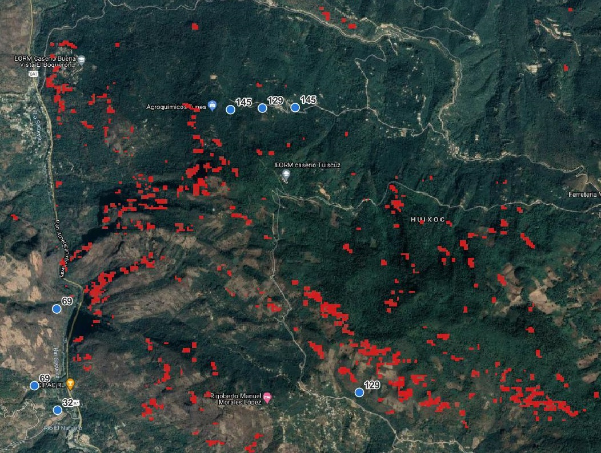
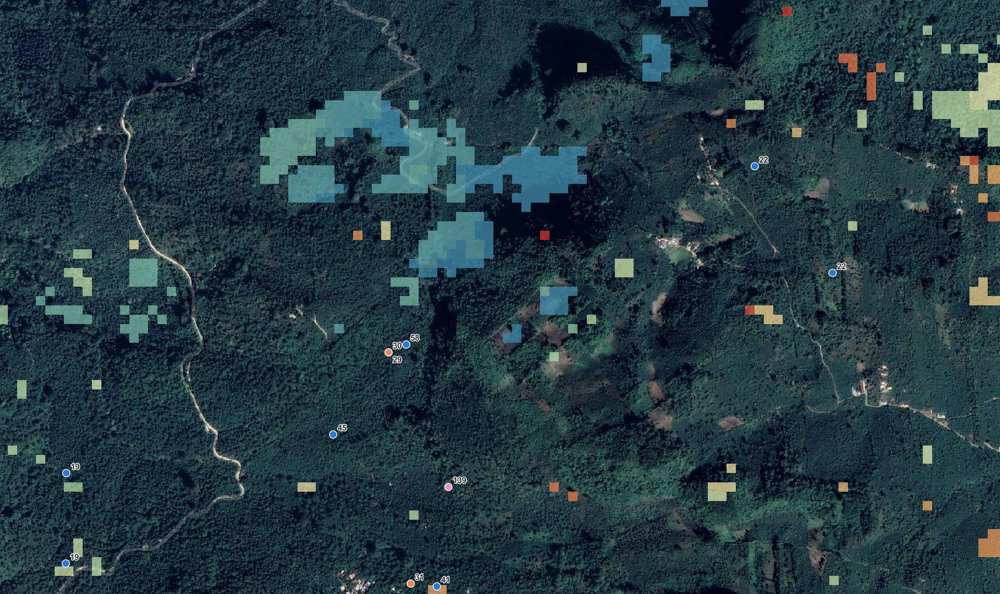

# 
 Incident Report For Union Coffee - Huehuetanango Region, Guatemala 

## Area of Interest 
|      | Details |
| ----------- | ----------- |
| **SKU of Interest**      | Arabica, [Huehuetanango](https://goo.gl/maps/ppYLv2LxCU6YCr8y6) – Guatemala       |
| **Farm & Farm Type**   | [UC-FID-135](https://goo.gl/maps/AScERrbLUimZeSFo8), 100% production sold through Coopertiva Esquipulas ForestMind ID3456         |
|**Analysis period**| 2017-2021|
|**Alert Date**| 17/10/21 |
|**Alert Type**| Unexpected production capacity increase |
|**Submitted to**|  Pascale Schuit, Union Coffee|
|**Date submitted**|October 2021|
|**Report reference**|FM-IR-UC-003 |
|**Report compiled by**|Holly Cooper, ForestMind |
|**Quality control by**  |Steve Jennings, ForestMind|

_Farm related to incident_

## Executive Summary

### Risk to a protected area

The sold volume of coffee beans reported from Farm [UC-FID-135](https://goo.gl/maps/ppYLv2LxCU6YCr8y6) increased substantially during 2021, suggesting the use of additional land areas for production. Earth observation suggests that additional forest clearing occurred on land contiguous to Farm UC-FID-135 in the first quarter of 2018.

##### Farm UC-FID-135 Production 
| Year | Coffee Produced (Kg) | % Change on previous year | Detail |
|:---|:---:| :---: | :---: |
|2017|2,134 Kg|-|[See Detail](https://c.tenor.com/JbNEIYy1jnQAAAAC/travolta-desert.gif)|
|2018|2,380 Kg|+11.5%|[See Detail](https://c.tenor.com/JbNEIYy1jnQAAAAC/travolta-desert.gif)|
|2019|2,516 Kg|+5.7%|[See Detail](https://c.tenor.com/JbNEIYy1jnQAAAAC/travolta-desert.gif)|
|2020|2,014 Kg|-19.9% |[See Detail](https://c.tenor.com/JbNEIYy1jnQAAAAC/travolta-desert.gif)|
|2021|4,580 Kg|+127.4%|[See Detail](https://c.tenor.com/JbNEIYy1jnQAAAAC/travolta-desert.gif)|

### Recommended immediate actions 

We recommend contacting the cooperative to confirm the expected production capacity of Farm **UC-FID-135**, and exploring the possibility of supplies from nearby illegally converted areas being ‘laundered’ here.   

##### Farm UC-FID-135 Potential Additional Forest Clearing

### Conclusion

If this link is verified, this deforestation event would likely be a contravention of the Guatemalan Forest Code which designates the area as protected. 

